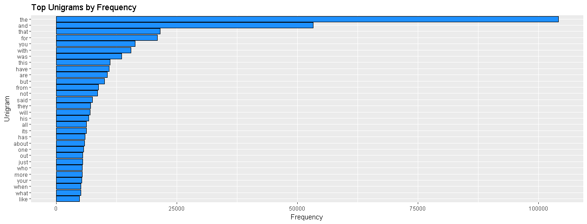
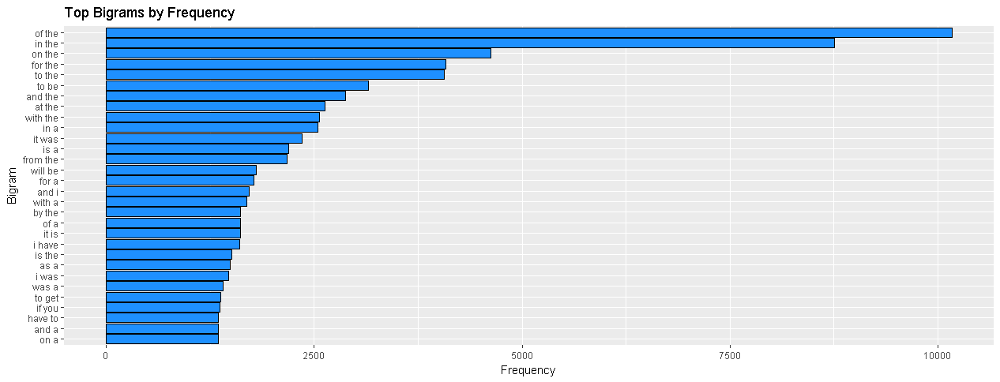

```{r setup, include=FALSE}
options(java.parameters = "-Xmx5g")
options(java.parameters = "-Xms5g")
memory.limit(size = 6000)
knitr::opts_chunk$set(echo = TRUE)
```

```{r environment, echo = FALSE}
# Enviroment values
R.version <- sessionInfo()$R.version$version.string
OS.version <- sessionInfo()$running
platform <- sessionInfo()$platform
```

```{r packages, echo = FALSE}
suppressMessages(library(jsonlite)) # JSON Parser and Generator
suppressMessages(library(beepr)) # Sound notifications
suppressMessages(library(RPushbullet)) # Interface to the Pushbullet Messaging Service
suppressMessages(library(stringr)) # Text manipulation
suppressMessages(library(tm)) # Text mining
suppressMessages(library(knitr)) # Report generation (including nice tables)
suppressMessages(library(RWeka)) # Machine learning algorithms for data mining
```

# Introduction

This is the Coursera Data Science Capstone SwiftKey Project by John Hopkins. 

As people around the world are spending more and more time on their mobile devices for email, social networking, banking, and many other activities, any device that that makes it easier for people to type is welcome. But typing on mobile devices can be a serious pain.

[SwiftKey](http://swiftkey.com), the textte partner in this capstone, among other things, is a world leader in predictive text analytics. Their custom keyboard app on Android and the SwiftKey Note app on iOS are well-known. SwiftKey has been even integrating their predictive text technology into Professor Stephen Hawking's existing system to improve his ability to communicate. 

The goal of this Capstone Project involves developing a predictive text application that is capable of inferring meaning and intent from text the user types to predict his next word, very similar to Swiftkey's technology implemented in our present smart phone keyboards. 

The application comprises of two parts: a prediction model algorithm, based on predictive model of text starting with a really large, unstructured database of the English language, and a Shiny app UI that implements it.

The data provided for this project comes for blogs, news, and twitter feeds in 4 different languages: German, English, Finnish, and Russian. For this project, however, we will be using only the English database.

In this report we will highlight the results of some exploratory data analysis and detail the next steps to complete the application.

This work was done with the resources of the R statistical data analysis language (R Core Team, 2016) `r R.version` on `r OS.version`. All efforts were made to conform to the best practices of Reproducible Research (Peng, 2011, 2016a). 

The following R packages were used for the data cleaning and analysis:

- *tm*, for text mining,
- *knitr*, for report generation (including nice tables),
- *ggplot2*, for graphs, and
- *RWeka*, for machine learning algorithms for data mining

# Data

The training data was provided by Coursera and is available at Coursera [site](https://d396qusza40orc.cloudfront.net/dsscapstone/dataset/Coursera-SwiftKey.zip).

After unzipping, one finds that it consists of texts in 4 different languages: 1) German, 2) English, 3) Finnish, and 4) Russian. One also finds that these texts come from  3 different sources: 1) blogs, 2) news, and 3) twitter feeds. For this project, however, we will be using only the English texts. 

```{r fileList}
path <- "data/en_US"
filenameList <- list.files(path)
fileURLList <- unname(sapply(filenameList, 
                             function(filename) paste0(path, "/", filename)))
```

The files containing English texts are named `r paste0(filenameList, collapse = ", ")`.

Now, we proceed to reading these files. 

```{r reading}
blogsData <-
    suppressMessages(readLines(
        con <-
            file(fileURLList[1]),
        encoding = "UTF-8",
        skipNul = TRUE
    ))
close(con)

newsData <-
    suppressMessages(readLines(
        con <-
            file(fileURLList[2]),
        encoding = "UTF-8",
        skipNul = TRUE
    ))
close(con)

twitterData <-
    suppressMessages(readLines(
        con <-
            file(fileURLList[3]),
        encoding = "UTF-8",
        skipNul = TRUE
    ))
close(con)
rm(con)

rm(path, filenameList, fileURLList)
```

# Pre-processing

Due to the size of the files, pre-processing, cleaning, and tokenising the entire data set would require either be unacceptable large amounts of RAM, time or machines. As a result, practitioners have chosen to use less data (Callison-Burch et al., 2012) or simpler smoothing methods, such as Brants et al. "Stupid Backoff" one (2007).

Thus, to reduce it, a sample is created by combining 1% samples from each text source. For reproducibility, a seed is set for the randomization algorithms involved in the sampling process.

```{r sampling}
set.seed(42) # The Answer to the Ultimate Question of Life, the Universe, and Everything (Douglas Adams)

blogsData <- sample(blogsData, 
                    length(blogsData) * 0.1, 
                    replace = TRUE)
newsData <- sample(newsData, 
                   length(newsData) * 0.1, 
                   replace = TRUE)
twitterData <- sample(twitterData, 
                      length(twitterData) * 0.1, 
                      replace = TRUE)

textSample <- paste(blogsData, newsData, twitterData)

# Remove old data to free memory space
rm(blogsData, newsData, twitterData)
```

Before removing punctuation, these texts must be broken into sentences, as it does not make much sense building prediction models across distinct sentences.  

```{r breaking, echo = FALSE}
# Break text into sentences
textSample <-
        unlist(
                lapply(textSample, function(text)
                        unlist(strsplit(text, "[;.!?]"))
                       )
                )
```

Now, the texts are converted to lowercase and cleaned to remove punctuation, slashes, numbers, extra white spaces, hashtags (#something), shouts (@somebody), e-mail addresses and URL's. Here, [regular expressions](http://en.wikipedia.org/wiki/Regular_expression), combinations of literals and a rich set of [metacharacters](http://en.wikipedia.org/wiki/Metacharacter), which are characters that have special meanings to a computer program, are useful to search through strings to identify specific patterns of interest that might be very hard to identify other way.

Common contractions were also converted, e.g. to transform "I'll b there 2day" to "i will be there today." The lists of contractions were obtained from the [Snowball project](http://snowball.tartarus.org/algorithms/english/stop.txt) and from the [ranks.nl site](http://www.ranks.nl/stopwords) 

Profanities were also removed. The list of profanity words was obtained from the [Shutterstock repo](http://github.com/shutterstock/List-of-Dirty-Naughty-Obscene-and-Otherwise-Bad-Words). Besides, bleeped words (e.g. 'f---', 'f***', 'f#@%') were also removed by means of regular expressions searches.

Stopwords, on the other hand, were left in, as they are present in normal language and could be the expected next input from a user

```{r cleaning}
source('functions/prepareText.R', echo = FALSE)
textSample <- 
        unlist(
                lapply(textSample, prepareText)
                )
```

After all this cleaning, we can proceed to prediction.

# Prediction

In the field of Natural Language Processing (NLP), $n$-grams are sets of $n$ co-occuring words within a given window in a sequence of text or speech.

Stemming describes the process of transforming a word into its root form, such as 'swim' from the word 'swimming', which can, however, create non-real words. In contrast, lemmatization aims to obtain the canonical (grammatically correct) forms of the words, the so-called lemmas, and is, consequently, computationally more difficult and expensive than stemming. In practice, it was shown that both stemming and lemmatization have little impact on the performance of text classification (Toman, Tesar & Jezek, 2006) and, therefore, none of these processes was adopted here.

Here, we will calculate the frequencies of isolated words (1-grams) and 2-grams, 3-grams, and 4-grams, i.e. combinations of two, three, and four words in the dataset. 

For that, we first constructed  for the various $n$-gram tokens. This process resulted in dataframes containing the top $n$-grams with their corresponding frequencies in the text. 

The proccess of $n$-gram creation resulted in many sparse terms, i.e., terms that rarely appear in the documents, which were then removed.

```{r tokenization}
# Function to create n-1 sentences s
sentenceExtractor <- function(text, n) {
        if (n > 0)
                temp <- word(text, 1, n-1)
        else
                temp <- ""
        return(temp)
}

# Function to extract the last word w
wordExtractor <- function(text) {
        temp <- word(text, -1)
        return(temp)
}

# Function to calculate n-gram frequency 
n_gramFreq <- function(text, n) {
        n_gram <- as.data.frame(
                table(
                        NGramTokenizer(text, 
                                       Weka_control(min = n, 
                                                    max = n)
                                       )
                        ),
                stringsAsFactors = FALSE)
        colnames(n_gram) <- c("n_gram", "Freq")
        
        if (n > 1) {
                # Decompose the n-grams into n-1 sentences and last words
                n_gram$w <- 
                        wordExtractor(n_gram$n_gram)
                n_gram$s <-
                        sentenceExtractor(n_gram$n_gram, n-1)
        }

        row.names(n_gram) <- NULL
        
        return(n_gram)
}

unigramFreqDF <- n_gramFreq(textSample, 1)
save(unigramFreqDF, file = "data/unigramFreq.RData")

bigramFreqDF <- n_gramFreq(textSample, 2)
save(bigramFreqDF, file = "data/bigramFreq.RData")

trigramFreqDF <- n_gramFreq(textSample, 3)
save(trigramFreqDF, file = "data/trigramFreq.RData")

fourgramFreqDF <- n_gramFreq(textSample, 4)
save(fourgramFreqDF, file = "data/fourgramFreq.RData")

rm(textSample)
```

From the , , [3-gram](images/Fig3.png) , and [4-gram](images/Fig4.png) graphs, one can see that '**the**' and '**and**' are by far the two most often occuring words, what is in accordance to their generalized use in normal speech. This also shows the appropriateness of our previous decision of not removing stopwords from the corpus, as doing so would have impacted our prediction model in a negative way.

Having the $n$-gram x frequency look-up tables, we proceeded to develop a predictive model using them, combined with a back-off technique, to calculate the probability of the next word occuring. 

```{r Sscores, echo = FALSE}
S2 <- function(row, Freq, s) {
        if (row %% 10 ^ 3 == 0)
                print(row)
        Freq / unigramFreqDF$Freq[unigramFreqDF$n_gram == s]
}

S3 <- function(row, Freq, s) {
        if (row %% 10 ^ 3 == 0)
                print(row)
        if (row %% 10 ^ 5 == 0)
                pbPost("note", paste("trigram milestone:", row), "")
        Freq / bigramFreqDF$Freq[bigramFreqDF$n_gram == s]
}

S4 <- function(row, Freq, s) {
        if (row %% 10 ^ 3 == 0)
                print(row)
        if (row %% 10 ^ 5 == 0)
                pbPost("note", paste("fourgram milestone:", row), "")
        Freq / trigramFreqDF$Freq[trigramFreqDF$n_gram == s]
}

N <- sum(unigramFreqDF$Freq)
unigramFreqDF$Sw <- unigramFreqDF$Freq / N

bigramFreqDF$Sw <- mapply(S2, as.integer(row.names(bigramFreqDF)), bigramFreqDF$Freq, bigramFreqDF$s)
unigramFreqDF$Freq <- NULL
unigramFreqDF$n_gram <- NULL
save(unigramFreqDF, file = "data/unigramFreq.RData")
pbPost("note", "bigram finished!", "")

trigramFreqDF$Sw <- mapply(S3, as.integer(row.names(trigramFreqDF)), trigramFreqDF$Freq, trigramFreqDF$s)
bigramFreqDF$Freq <- NULL
bigramFreqDF$n_gram <- NULL
save(bigramFreqDF, file = "data/bigramFreq.RData")
pbPost("note", "trigram finished!", "")

fourgramFreqDF$Sw <- mapply(S4, as.integer(row.names(fourgramFreqDF)), fourgramFreqDF$Freq, fourgramFreqDF$s)
trigramFreqDF$Freq <- NULL
trigramFreqDF$n_gram <- NULL
save(trigramFreqDF, file = "data/trigramFreq.RData")
fourgramFreqDF$Freq <- NULL
fourgramFreqDF$n_gram <- NULL
save(fourgramFreqDF, file = "data/fourgramFreq.RData")
pbPost("note", "fourgram finished!", "")
```

```{r MLfiltering, echo = FALSE}
sList <- data.frame(s = unique(bigramFreqDF$s), stringsAsFactors = FALSE)
bigramFreqDF <- bigramFreqDF[order(bigramFreqDF$Sw, decreasing = TRUE),]
row.names(bigramFreqDF) <- NULL
MLtops2 <- function(row, s) {
        if (row %% 10 ^ 3 == 0)
                print(row)
        head(bigramFreqDF[bigramFreqDF$s == s,], 1)
}
bigramFreqDF <- as.data.frame(t(mapply(MLtops2, 1:nrow(sList), sList$s)), stringsAsFactors = FALSE)
row.names(bigramFreqDF) <- NULL

sList <- data.frame(s = unique(trigramFreqDF$s), stringsAsFactors = FALSE)
trigramFreqDF <- trigramFreqDF[order(trigramFreqDF$Sw, decreasing = TRUE),]
row.names(trigramFreqDF) <- NULL
MLtops3 <- function(row, s) {
        if (row %% 10 ^ 3 == 0)
                print(row)
        if (row %% 10 ^ 5 == 0)
                pbPost("note", paste("trigram milestone:", row), "")
        head(trigramFreqDF[trigramFreqDF$s == s,], 1)
}
trigramFreqDF <- as.data.frame(t(mapply(MLtops3, 1:nrow(sList), sList$s)), stringsAsFactors = FALSE)
row.names(trigramFreqDF) <- NULL
str(trigramFreqDF)
head(trigramFreqDF)
pbPost("note", "trigram finished!", "")

sList <- data.frame(s = unique(fourgramFreqDF$s), stringsAsFactors = FALSE)
fourgramFreqDF <- fourgramFreqDF[order(fourgramFreqDF$Sw, decreasing = TRUE),]
row.names(fourgramFreqDF) <- NULL
MLtops4 <- function(row, s) {
        if (row %% 10 ^ 3 == 0)
                print(row)
        if (row %% 10 ^ 5 == 0)
                pbPost("note", paste("fourgram milestone:", row), "")
        head(fourgramFreqDF[fourgramFreqDF$s == s,], 1)
}
fourgramFreqDF <- as.data.frame(t(mapply(MLtops4, 1:nrow(sList), sList$s)), stringsAsFactors = FALSE)
row.names(fourgramFreqDF) <- NULL
str(fourgramFreqDF)
head(fourgramFreqDF)
pbPost("note", "fourgram finished!", "")
```


# Shiny interface app 
For the user interface, it was created a Shiny app with a simple and intuitive front end interface for the user. The text input is tokenised, its last 3 or 2 (or 1 if it's a unigram) words isolated, and cross checked against the tables to get the highest probability next word, which is then displayed.

The working app is available [here](https://jdtcob.shinyapps.io/project/) and the slide deck is available [here]().


# References
- Bayes, T., & Price, R. (1763). An Essay towards Solving a Problem in the Doctrine of Chances. By the Late Rev. Mr. Bayes, F. R. S. Communicated by Mr. Price, in a Letter to John Canton, A. M. F. R. S. *Philosophical Transactions of the Royal Society*, *53*, 370-418.
- Brants, T., Popat, A. C., Xu, P., Och, F. J., & Dean, J. (2007). Large Language Models in Machine Translation. In *Proceedings of the 2007 Joint Conference on Empirical Methods in Natural Language Processing and Computational Natural Language Learning*, Prague, June 2007 (pp. 858-867). Stroudsburg, PA: ACL - Association for Computational Linguistics.
- Markov, A. A. (1906). Rasprostranenie zakona bol'shih chisel na velichiny, zavisyaschie drug ot druga (The extension of the law of large numbers onto quantities depending on each other). *Izvestiya Fiziko-Matematicheskogo Obschestva Pri Kazanskom Universitete*, 2-Ya Seriya, 15, 135-156.
- Peng, R. D. (2011). *Reproducible Research in Computational Science*. Victoria, CA-BC: Leanpub.
- Peng, R. D. (2016a). *Report Writing for Data Science in R*. Victoria, CA-BC: Leanpub.
- Peng, R. D. (2016b). *Exploratory Data Analysis with R*. Victoria, CA-BC: Leanpub. 
- R Core Team (2016). *R: A language and environment for statistical computing*. R Foundation for Statistical Computing, Vienna, Austria. Avaliable at R site: https://www.R-project.org/.
- Toman, M., Tesar, R., & Jezek, K. (2006). Influence of Word Normalization on Text Classification. In *I International Conference on Multidisciplinary Information Sciences and Technologies (InSciT2006)*, Merida, Spain, October, 25-28th, 2006 (pp. 354-358). Mérida: University of Extremadura and the Open Institute of Knowledge.
